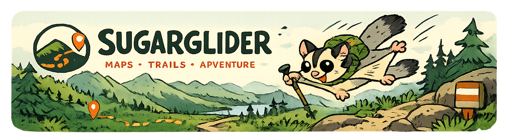

<p align="center">
  
</p>

<p align="center">
  <strong>Generate trail-running routes from required places and a target distance.</strong>
</p>

# Sugarglider

Sugarglider is an open-source trail-running route generator in development. The
long-term product will combine required waypoints, target distance, trail and nature
preferences, popularity signals, access rules, and limits on repeated sections.

The implemented PR1–PR5 scope accepts mandatory latitude/longitude anchors, asks a
self-hosted GraphHopper 11.0 instance to route them along real OpenStreetMap edges,
analyzes the routed edges, and can search for several closed-loop candidates near a
target distance. Any selected geometry exports as one clean GPX 1.1 track.

## Current scope and architecture

```text
client -> FastAPI -> RouteService -----------> routing backend -> GraphHopper / OSM
                    RouteGenerationService --+       |
                       |                              +-> routed path details
                       +-> sampling, ordering, low-overlap beam search
                       +-> analysis, score, diversity
                    GPX writer
```

The public API uses named `lat` and `lon` fields. The adapter converts anchors to
GraphHopper's `[longitude, latitude]` JSON order and preserves that same GeoJSON
order in routed responses. The GPX writer then emits the final routed coordinates as
`lat` and `lon` trackpoint attributes. It never draws, interpolates, or falls back to
straight lines.

The analyzer uses standard-library haversine distances for every geometry edge and
normalizes them to GraphHopper's authoritative route distance. Raw path-detail
breakdowns remain available alongside explainable derived metrics. Generation uses
a fixed, documented PR3 score; ordinary route analysis does not assign a score.

Generation defaults to fixed required-anchor order. An explicit optimized-loop mode
keeps the first point fixed while proposing deterministic visit orders for every
other mandatory point. Generation then closes the sequence, asks GraphHopper for
round-trip detour proposals, samples those proposal geometries at cumulative-distance
positions, and reroutes the complete sequence. Proposal coordinates never become
route lines: only final GraphHopper geometry is returned.

## Prerequisites

- Python 3.13
- [`uv`](https://docs.astral.sh/uv/)
- Docker with Docker Compose
- `curl` and several gigabytes of free disk space for the Île-de-France extract and
  imported graph

## Local Python setup and checks

Install the locked Python environment:

```sh
uv sync
```

Run the complete service-independent check suite:

```sh
make check
```

This checks Ruff formatting and lint, strict mypy typing, and all tests except those
marked `integration`. Unit tests use an in-memory HTTP transport and require neither
Docker, internet access, map data, nor GraphHopper.

To run the API directly against a GraphHopper exposed on the host:

```sh
cp .env.example .env
uv run uvicorn sugarglider.api.main:app --reload
```

## Map data and Docker startup

Download the Geofabrik Île-de-France PBF explicitly:

```sh
make download-osm
```

The script is idempotent, writes through a temporary file, and supports
`FORCE=1` and an `OSM_PBF_URL` override. PBF files and imported graph caches are
ignored by Git.

Start GraphHopper and the API:

```sh
make up
make logs
```

The first GraphHopper startup imports the PBF and creates the hiking graph and
landmark preparation under `data/graph-cache`; this can take several minutes and
substantial memory. Later starts reuse the bind-mounted cache. If the GraphHopper
configuration or PBF changes incompatibly, stop the stack and deliberately clear
the contents of `data/graph-cache` before rebuilding. Compose exposes GraphHopper
at `http://localhost:8989` and the API at `http://localhost:8000`.

## API

- `GET /health` checks only that the FastAPI process is alive.
- `GET /ready` checks GraphHopper `/info` and requires its `hike` profile.
- `POST /v1/routes` returns routed GeoJSON-order coordinates, summary metrics,
  snapped anchors, raw path details, and typed route analysis.
- `POST /v1/routes/gpx` computes the same route and returns a downloadable GPX
  containing exactly one track and one segment.
- `POST /v1/routes/generate` returns the required-anchor baseline, ranked candidates,
  and bounded-search diagnostics.
- `POST /v1/routes/generate/gpx` repeats the deterministic search and exports its
  best candidate as the same clean, track-only GPX format.

### Target-distance generation

Generation supports closed loops only. Supply at least two and at most 30 required
points without manually repeating the start; Sugarglider appends the start without
mutating the caller's list. Every required point remains mandatory. The default
`point_order_mode="fixed"` retains input order. With
`point_order_mode="optimize_loop"`, the first point remains start/end while all
other points become reorderable.
`target_distance_m` accepts 1–200 km, tolerance accepts 0.1–10 km, and one to five
candidates can be requested.

Path selection defaults to `path_selection_mode="shortest"`, which preserves the
PR4 result and ranking. Explicit `path_selection_mode="low_overlap"` first runs the
same standard generation, then refines up to two selected candidates. For every
consecutive pair in a candidate's exact routing-point sequence, GraphHopper returns
up to three graph-valid alternatives. A deterministic beam of at most 12 partial
routes composes those legs and analyzes repeated edge IDs across the complete route.
The separate default alternative-leg request budget is 48; identical leg requests
are cached across refinement sources.

Low-overlap recommendation still requires target tolerance first. A refined route
may outrank its standard source only when it lowers total repeated-edge share without
increasing immediate backtracking. Qualifying routes then rank by repetition,
backtracking, the existing PR3 score, target error, and stable signature. A route
that trades lower repetition for more obvious out-and-back traversal may still be
returned for comparison, but it is not recommended ahead of its source. One standard
candidate is retained as the public control. This optimization changes path
selection for an already chosen point order; it does not reorder mandatory POIs.

Optimized mode evaluates at most 16 unique order proposals: original order,
clockwise and counter-clockwise angular sweeps, nearest-neighbour cycles, angular
cuts, and bounded 2-opt refinements. This is a deterministic geometric heuristic,
not exact TSP. At most three routed orders continue into detour generation, and all
order and detour evaluations share one full-route budget. Retention always protects
the best below-target order so it can be lengthened, even when longer mandatory
routes rank better as final candidates.

The detour search is deliberately small and deterministic for a fixed graph,
request, seed, and settings. It tries factors `0.60`, `0.80`, `1.00`,
`1.20`, and `1.45` at each distinct required anchor, samples positions near 25%,
50%, and 75% of each proposal, and performs at most one refinement for a few close
candidates. Full routes use `pass_through=true`; optional points whose snapped
positions move more than 300 m are rejected. Exact point sequences are cached and
the default full-candidate evaluation budget is 48. GraphHopper round-trip distance
is approximate, and inserted proposal points are subsequently rerouted through the
entire required sequence, so the requested distance is not guaranteed.

Search statuses mean:

- `within_tolerance`: at least one returned candidate meets the requested tolerance;
- `best_effort`: candidates exist, but none meets it;
- `infeasible`: every successfully routed mandatory order exceeds target plus
  tolerance. The JSON result still contains the original fixed-order baseline.

Order counters exclude that fixed baseline. Every attempted non-baseline order is
classified exactly once as either a successful distinct source or a rejected
routing, snapped-waypoint, or duplicate-signature result.

Within-tolerance candidates always rank before candidates outside tolerance. Among
within-tolerance routes, ranking minimizes immediate backtracking, then total
repetition, the PR3 total score, absolute target error, and stable signature.
Outside tolerance, distance error retains strong pressure. The fixed PR3 score is:

```text
10.00 × distance error ratio
+ 3.00 × repeated-distance share
+ 2.00 × major-road share
+ 1.00 × paved share
+ 0.25 × unknown-surface share
- 1.50 × trail-like share
- 0.75 × official-hiking-network share
```

The response exposes every weighted component. Reward fields are positive
magnitudes subtracted from `total`. Target distance is the primary objective;
unknown surface has only a small uncertainty penalty and is not treated as paved or
as automatically poor trail. Stable SHA-256 signatures deduplicate candidates,
using edge runs when coverage is high and six-decimal geometry otherwise. A simple
edge-ID-set Jaccard filter prefers distinct routes and reports when low coverage or
candidate count requires relaxed diversity.

Every candidate exposes `required_point_order`, retaining original request indices
and coordinates. It includes the fixed start once and excludes automatic closure.
It also exposes immutable `routing_points`, containing the exact required and
generated points in construction order without the automatic closing duplicate,
and a `construction` value: `direct_order`, `round_trip_detour`, or
`alternative_leg_beam`. For optimized requests, `baseline` is deliberately the
original fixed-order route.

Low-overlap optimization uses exact GraphHopper edge IDs. It cannot recognize nearby
parallel corridors as overlap, does not guarantee zero repetition, and cannot avoid
retracing forced by dead-end POIs. Dynamic history-dependent Java edge penalties,
custom GraphHopper plugins, and exact simple-cycle solving remain future work. The
GUI and nature/land-cover scoring also remain future work.

`SearchSummary.low_overlap_requested` distinguishes a search that did not run from
one that found perfect zero overlap. The pre/refined repetition and backtracking
shares are therefore `null` in shortest mode or when no standard source exists,
rather than using a misleading zero.

Generate the Marly 41 km example as JSON:

```sh
curl --fail --header 'Content-Type: application/json' \
  --data-binary @examples/marly/generation-request.json \
  http://localhost:8000/v1/routes/generate
```

Export its best candidate:

```sh
curl --fail --header 'Content-Type: application/json' \
  --data-binary @examples/marly/generation-request.json \
  --output /tmp/sugarglider-marly-41km.gpx \
  http://localhost:8000/v1/routes/generate/gpx
```

Or run the full readiness, JSON report, GPX export, and XML validation workflow:

```sh
make generate
# Custom JSON and GPX destinations:
./scripts/generate_marly.sh ./marly-generation.json ./marly-41km.gpx
```

Generate and validate the 23-POI optimized Marly loop:

```sh
make generate-all-pois
# Custom destinations:
./scripts/generate_marly_all_pois.sh ./all-pois.json ./all-pois.gpx
```

Generation makes several local GraphHopper calls and is intended for interactive
requests measured in seconds, not a high-throughput endpoint. The GPX endpoint
repeats the search rather than persisting the JSON endpoint's result.

### Route-analysis metrics

Every share is relative to the complete GraphHopper route distance:

- `paved`, `unpaved`, and `unknown_surface` partition the whole route. Unknown
  includes absent surface coverage, explicit nulls, missing/other values, and future
  unrecognized values.
- `trail_like` measures edges whose road class is track, path, footway, bridleway,
  steps, or pedestrian.
- `official_hiking_network` measures edges explicitly tagged with international,
  national, regional, or local foot-network membership.
- `major_road` measures travel on motorway, trunk, primary, secondary, or tertiary
  classified edges. It is not traffic measurement and does not measure proximity to
  a nearby road.
- `car_accessible` requires an explicit `car_access=true`; missing access data is
  not assumed true.
- `repetition` counts distinct GraphHopper edge IDs used in multiple traversal runs
  and measures only later runs as repeated distance. Its coverage and warnings must
  be considered because repetition cannot be inferred when `edge_id` is absent.
- `immediate_backtrack` is narrower than total repetition. It counts only the
  returning half of direction-reversed edge stacks such as `A → B → A`, retaining
  up to 64 outward geometry-edge traversals. Longer spurs deterministically count
  only their innermost 64 returning edges. `backtrack_edge_id_coverage` and warnings
  expose uncertainty.
- `detail_breakdowns` reports explicit values and coverage for every returned path
  detail. Explicit null is a bucket; uncovered geometry is not invented as a value.

For example, the JSON response includes this shape (values are illustrative):

```json
{
  "analysis": {
    "route_distance_m": 22515.9,
    "geometry_distance_m": 22480.1,
    "distance_scale_factor": 1.00159,
    "paved": {"distance_m": 7000.0, "share": 0.31},
    "unpaved": {"distance_m": 13000.0, "share": 0.58},
    "unknown_surface": {"distance_m": 2515.9, "share": 0.11},
    "trail_like": {"distance_m": 15000.0, "share": 0.67},
    "official_hiking_network": {"distance_m": 9000.0, "share": 0.40},
    "major_road": {"distance_m": 500.0, "share": 0.02},
    "car_accessible": {"distance_m": 6000.0, "share": 0.27},
    "repetition": {
      "edge_id_coverage": {"distance_m": 22000.0, "share": 0.977},
      "available": true,
      "unique_edge_count": 180,
      "traversed_edge_run_count": 187,
      "repeated_edge_count": 5,
      "repeated_distance": {"distance_m": 650.0, "share": 0.029}
    },
    "warnings": ["edge_id_coverage_incomplete"]
  }
}
```

Percentages depend on the completeness and accuracy of OSM tags exposed through
GraphHopper. Missing coverage is retained in breakdown coverage, unknown-surface
distance, and deterministic warnings rather than guessed.

Route the Marly request as JSON:

```sh
curl --fail --header 'Content-Type: application/json' \
  --data-binary @examples/marly/request.json \
  http://localhost:8000/v1/routes
```

Export it as GPX:

```sh
curl --fail --header 'Content-Type: application/json' \
  --data-binary @examples/marly/request.json \
  --output /tmp/marly.gpx \
  http://localhost:8000/v1/routes/gpx
```

Or run the smoke check, which verifies readiness and validates the resulting XML
shape:

```sh
make smoke
# Custom destination:
./scripts/smoke_marly.sh ./marly.gpx
```

Generate a saved JSON response and print a compact Marly analysis report:

```sh
make report
# Custom destination:
./scripts/report_marly.sh ./marly-analysis.json
```

The reporting script uses Python rather than `jq` and prints all derived percentages,
repeated-edge distance, edge-ID coverage, and warnings.

After the stack is healthy, opt into the live integration test with:

```sh
RUN_GRAPHHOPPER_INTEGRATION=1 \
GRAPHHOPPER_URL=http://localhost:8989 \
uv run pytest -m integration
```

Stop the services with `make down`.

## Data attribution and safety

Routing uses © [OpenStreetMap contributors](https://www.openstreetmap.org/copyright)
data distributed by [Geofabrik](https://download.geofabrik.de/) under the Open Data
Commons Open Database License (ODbL). This is attribution, not a legal
interpretation; downstream redistributors remain responsible for their obligations.

OpenStreetMap and routing engines can be incomplete or out of date. Generated
routes must still be checked against current local closures, land-access rules,
conditions, and on-the-ground signage before use.

## Current limitations and future work

All anchors remain mandatory. Fixed mode visits them as supplied; optimized mode
keeps the start fixed and uses bounded deterministic ordering rather than a globally
optimal solver. Exact POIs on dead-end paths can force unavoidable retracing. The
score is an explainable starting heuristic rather than a scientifically validated
measure of quality, and edge-ID diversity is set-based rather than distance-weighted.
Elevation is disabled, so GPX trackpoints contain no invented elevations or
timestamps, and GPX files contain no analysis extensions.

Nature areas, land cover, popularity, uploaded activities, current closures, and
real-world trail conditions are not modeled, and there is no web GUI yet. OSM tags
and access data may be absent or stale. Every generated route still requires visual
inspection and validation against local access rules, signage, closures, and
conditions on the ground.
---

<p align="center">
  
</p>
