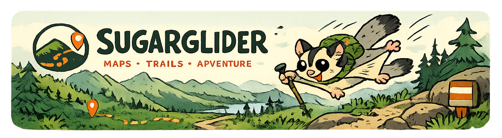

<p align="center">
  
</p>

# Sugarglider

Sugarglider plans walking, trail-running and cycling routes on mapped OpenStreetMap
paths. Choose a Start and ask for a loop, or add stops to connect. Compare the returned
routes, inspect mapped Places, and export the selected route as a clean GPX track.

The Android app plans **on the device with Valhalla** after an offline region is
installed. The Python application is the **reference/backend planner using an external
GraphHopper process**. Ordinary Android planning does not need that server.

## What you can do

- Plan Auto Tour loops or Waypoint Routes through explicit stops. Automatic route
  intent chooses between them as you edit; imported requests retain their explicit mode.
- Use six public activities: `hike`, `trail_run`, `city_bike`, `gravel_bike`,
  `mountain_bike`, and `road_bike`.
- Download an explicit versioned region containing maps, routing, Places and Nature.
  The bundled catalog advertises Yvelines and western Paris coverage; its manifest
  defines the bounds. Installed Android regions support local planning and maps.
- Inspect scenic places, mapped water and ice-cream shops from local OSM-derived data.
  Inspecting a Place does not add a route stop. An explicit preference/edit is separate.
- Export the already selected candidate, or inspect an imported GPX locally while
  preserving segment breaks. Exports contain one track and one segment, with no route
  or analysis extensions.

The reference planner supports more constraint/refinement options than the on-device
planner. Unsupported local requests fail explicitly without weakening their settings.
See [planning capabilities](docs/planning-model.md#platform-capabilities).

## The four system boundaries

| Surface | Routing and storage | Current role |
| --- | --- | --- |
| Android bundled app | Local Valhalla; native routing archive plus browser OPFS map/index storage | Ordinary offline regional planning, Places and GPX. Sharing, outings and live publication are disabled by packaged policy. |
| Python reference app | External GraphHopper; startup-loaded local indexes; optional SQLite persistence | Full canonical planning API and shared browser UI. |
| Static regional host | Immutable manifests and downloadable component files | Region distribution only; no planner or social database. |
| Optional social service | SQLite route/outing snapshots and latest live positions | Deployable sharing service without routing. Repository CI validates/smokes it; that is not evidence of a live deployment. |

The UI, canonical request/result shape and GPX contract are shared. Python and local
JavaScript searches are separate implementations with different capabilities.

## Start developing

For the service-independent Python checks, install Python 3.13 and
[`uv`](https://docs.astral.sh/uv/), then run:

```sh
uv sync --frozen
make check
```

`make check` runs Ruff formatting/lint, strict mypy and all non-integration Python
tests. It needs no Docker, network, map data or external services once dependencies
are installed.

For the reference browser/API, install Docker Compose, copy the example environment,
and explicitly obtain the OSM extract before starting the stack:

```sh
cp .env.example .env
make download-osm
make up
```

Open `http://localhost:8000` after GraphHopper imports its graph. Index building,
local API startup and integration checks are covered in [development](docs/development.md).
These steps run the reference environment; they are not Android prerequisites.

For Android, install JDK 17 and Android SDK 36, configure the SDK location, and run:

```sh
make android-check
make android-apk
```

The debug APK is `android/app/build/outputs/apk/debug/app-debug.apk`. Install only on
an explicitly chosen test device. Both build variants use the same local router;
release distribution/signing is a separate operation.

## Read the code with a map

| Guide | Start here to understand |
| --- | --- |
| [Architecture](docs/architecture.md) | Entry points, platform boundaries, state ownership and authoritative data. |
| [Android architecture](docs/android-architecture.md) | Bundled WebView, native bridge, Valhalla, permissions and disabled capabilities. |
| [Planning model](docs/planning-model.md) | Automatic intent, canonical modes, constraints, budgets, evaluation and ranking. |
| [Regions and Places](docs/regions-and-places.md) | OSM pipeline, component installation/update, Places, ice cream and Nature. |
| [Social service](docs/social-service.md) | Immutable saved routes, independent outing routes, current positions and deployment evidence. |
| [Development](docs/development.md) | Setup, browser/JVM/unit checks, scripts and safe change boundaries. |

PR-number documents and acceptance reports remain historical evidence and detailed
runbooks. Start with the guides above for current behavior; use dated records for the
specific milestone or artifact they describe.

## Limits that matter

Routing profiles express preferences over mapped data. They do not guarantee access,
legality, opening, current surface condition, potability or rideability. Elevation is
not used for planning. Missing path details or regional analysis remain visibly
unknown; a reported zero is not proof of complete coverage.

No route uses a straight-line fallback. A chosen Android region must cover the request;
regions are not silently stitched together and there is no hidden server fallback.
Target distance is a search objective, not a promise of an exact length.

The Play-oriented Android policy enables local planning and private current-location
use, but disables social sharing and background tracking. The compiled tracking code
is not an enabled release feature. The manifest has Internet/coarse/fine location
permissions and no tracking service or background-location permission.

Third-party raster tiles are never prefetched or persisted. Offline maps come from
explicit licensed regional packs, with visible attribution. Popularity signals remain
future work. Generated regional data, graphs, GPX, screenshots and secrets stay out of Git.
