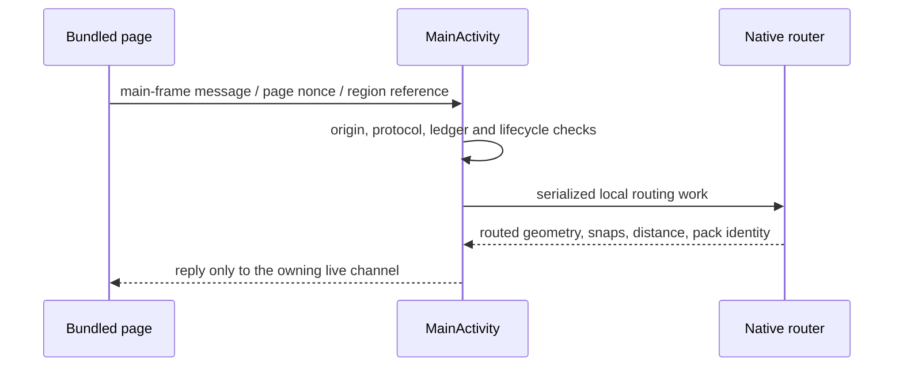

# Android architecture

The APK bundles the shared web UI and a native Valhalla router. After an explicit
regional download, normal planning, map display, Places and GPX do not need the Python
reference server. Both debug and release variants construct the same local router.

## Enabled versus present in source

| Capability | Current packaged policy |
| --- | --- |
| Local Auto Tour / Waypoint Route | Enabled when a complete compatible region is installed; see [local limits](planning-model.md#platform-capabilities). |
| Regional downloads / local maps / Places / Nature | Enabled; Internet is needed for download, installed components are read locally. |
| Private current-location button | User initiated, foreground browser geolocation through native permission handling; no social publication. |
| GPX saving | Shared serialization followed by Android's document picker. |
| Saved-route sharing / outings / live publication | Disabled by `android_ui_config.json` and `V1ReleasePolicy.sharingEnabled = false`. |
| Native screen-off tracking service | Implementation remains compiled, but the main manifest declares no service and release policy rejects its authority. |
| Web PWA/service worker | Android uses bundled assets and deliberately skips service-worker registration. |

The initial false POI/Nature availability fields in `android_ui_config.json` describe
startup before regional activation, not removal of regional analysis. Region readiness
updates local availability. Social false flags are reinforced by the native policy;
a preference or imported request cannot enable them.

## Bundled page and bridge

`MainActivity.kt` opens the local origin `https://appassets.androidplatform.net`.
`BundledShellAssets.kt` serves only the allowlisted shell/config files.
`BundledShellPolicy.kt` prevents a missing local asset or endpoint from falling through
to network. No arbitrary server-origin setup is part of ordinary planning.

Gradle's `bundleSharedWebShell` copies the paths in `android/shell-assets.txt` directly
from `src/sugarglider/web/static`. Those copies must stay byte-identical. Brand assets
originate in `assets/brand`; runtime copies are synchronized, not independently edited.

The bridge uses `WebViewCompat.addWebMessageListener`, one exact origin and main-frame
checks. There is no `addJavascriptInterface`, wildcard origin or cross-origin authority
handoff. `BridgeProtocol.kt` validates message types/limits; the ledger owns replay and
request identity; a navigation epoch invalidates callbacks from a replaced page.

## Local routing and regional storage

`NativeRouteEngine.kt` defines the typed native contract.
`NativeRouteEngineFactory.kt` creates the Valhalla mobile adapter in both variants.
`ValhallaProfilePolicy.kt` maps all six public activities to engine costing preferences.
The returned engine distance and snapped points are used by the shared local planner.
Missing path attributes/exact edge IDs remain unknown; Python quality/refinement
features are not implied by the common result shape.

`RegionalRoutingRepository.kt` manages validated app-private archives keyed by region,
build and routing identity. Routing holds the appropriate lease while the actor uses
that archive. The actor uses one current pack and disables auxiliary/default data
paths. It never switches to another region, a network router or invented geometry.

Maps, Places and Nature live in browser OPFS through the shared regional stores.
`region_product.js` coordinates them with the native routing component;
`region_versions.js` publishes the final committed version. See
[regions and Places](regions-and-places.md) for staging, replacement and failure states.

## GPX and lifecycle

The shared GPX worker serializes the selected immutable candidate. `native_gpx_save.js`
sends bounded already serialized bytes; `GpxDocumentSave.kt` only manages document
selection/writing and its outcome. It never performs planning. A save cannot be
reported successful merely because a picker opened. A recreation during saving
preserves an uncertainty notice, not GPX bytes, a document URI or capability.

MainActivity retains its live WebView across declared size/configuration changes.
Destroying/replacing the page invalidates pending bridge work; late worker replies
cannot mutate a new page. Renderer loss opens a fresh planner rather than reconstructing
participant authority or automatically regenerating a route. Android Back first lets
the page handle its current contextual surface.

## Permissions and location

The main manifest declares `INTERNET`, `ACCESS_COARSE_LOCATION` and
`ACCESS_FINE_LOCATION`. It has no background-location permission, notification/foreground
service permissions or tracking service. Backup and release cleartext traffic are disabled.
Debug has a separate development network-security configuration; this does not enable
sharing or alter the routing engine.

`planner_location.js` begins private current-location use from an explicit action.
`WebGeolocationPermissionCoordinator.kt` scopes permission callbacks to the owning
WebView page. It does not publish an outing position. Loading the app, a route or a
region does not start sharing.

`NativeTrackingEngine.kt` and `LocationSharingService.kt` retain the earlier optional
tracking design: one encrypted participant session, one latest pending fix, foreground
notification and explicit Stop, no automatic restart after process death. They are
**not reachable product capabilities under the current policy**. Historical tracking
reports must not be used as a current permission/service inventory.

## Development and distribution

Use JDK 17, Android SDK/build tools 36 and the checked-in Gradle wrapper. JVM/lint/debug
checks are in [development](development.md). Local tests do not establish physical-device
acceptance, and a source manifest does not substitute for a merged artifact inventory.
Application release versions live in `android/app/build.gradle.kts`; Python package
metadata is independent. Signing, device installation and Play operations are separate
explicit release tasks. A documentation change must not bump or sign a version.

## External itinerary handoff

The launcher/singleTop activity receives ACTION_SEND text/plain or application/json
and ACTION_VIEW content:// application/json. ExternalItineraryIntentParser enforces
64 KiB UTF-8 and temporary readable content grants; it does not parse the draft schema.
Drafts/URIs are never persisted or logged. Pending input is volatile/latest-only;
recreation drops it and suppresses launch-intent replay. Warm handoff keeps the local
WebView; a remote screen switches back to the bundled planner.

After the controller declares its dialog state through the trusted bridge, one
native envelope prefills input. The normal web Review/parser/preview/Import flow
remains authoritative. Native clears a delivered draft; document nonce and epoch
ownership prevent stale page delivery. Android Back first sends a scoped cancel
message when this modal is open. No new network, permission, provider integration,
automatic import or automatic generation is added.
