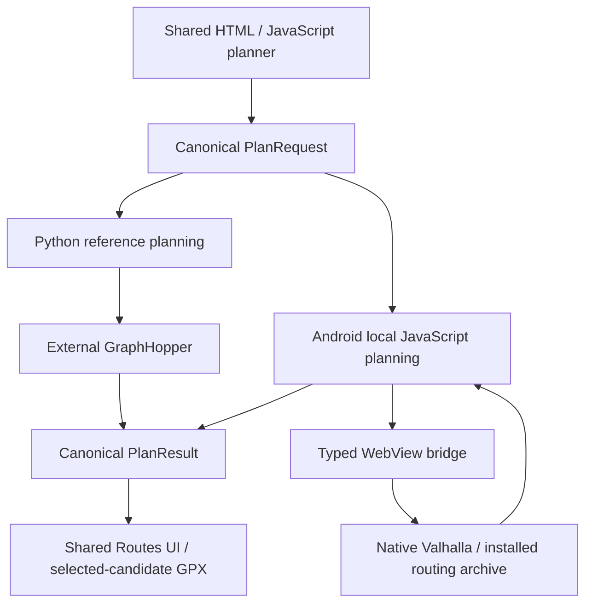

# Architecture

Sugarglider has one shared browser presentation and two planning implementations.
Android packages the presentation and routes locally. The Python/reference app sends
route requests to an external GraphHopper process. Static region distribution and the
optional social service have separate responsibilities.

These paths share contracts rather than identical algorithms. The local planner rejects
unsupported intents explicitly. Its failures do not invoke the Python API.

## Entry points

| Area | Read these files first | What they own |
| --- | --- | --- |
| Reference application | `src/sugarglider/api/main.py`, `api/routes.py` | Startup dependencies, local indexes and HTTP adaptation. |
| Python planning | `planning/pipeline.py`, `planning/models.py`, `planning/result.py` | Mode dispatch, canonical intent and immutable public results. |
| Python route boundary | `planning/context.py`, `planning/routing_gateway.py`, `routing/graphhopper.py` | Request budget/cache and typed GraphHopper calls. |
| Shared UI | `web/static/app.js`, `state.js`, `automatic_intent.js` | Composition, editable drafts and automatic mode policy. |
| Map presentation | `web/static/map.js`, `map_viewport.js` | Map layers, markers, selection and camera; not plan authority. |
| Android local planning | `web/static/local_planner.js`, `local_planning_context.js`, `local_plan_publisher.js` | One active search, native call accounting and canonical publication. |
| Android native application | `android/app/src/main/java/io/github/victorgabillon/sugarglider/MainActivity.kt`, `NativeRouteEngineFactory.kt` | Bundled page, bridge and local Valhalla actor. |
| Regional installation | `web/static/region_product.js`, `region_versions.js`, `RegionalRoutingRepository.kt` in the Android package above | Coordinated component staging, committed build and native routing leases. |
| Regional data generation | `offline_regions/build.py`, `pois/build.py`, `nature/build.py` | Deterministic local PBF-derived artifacts. |
| Optional social application | `social_server/app.py`, `saved_routes/`, `outings/` | Immutable snapshots, membership and latest positions; no planner. |

All Python paths above are under `src/sugarglider/`. Android file references use the
package directory shown above. Detailed platform differences are in
[Android architecture](android-architecture.md) and [planning](planning-model.md).

## What is authoritative

| Fact | Authority | Consequence |
| --- | --- | --- |
| Editable intent | Browser draft in `state.js`, serialized by `currentPlanRequest()` | Rendered labels and selected markers cannot silently change coordinates or stops. |
| Public planning contract | Immutable models in `planning/models.py` and `planning/result.py`; local publication validates the same shape | UI policy is not a new wire mode or schema. |
| Geometry and distance | Routing engine's returned path and total distance | Analysis normalizes geometry-edge lengths to that total; proposals never become straight-line route geometry. |
| Python profile identity | Immutable `routing/profiles.py` registry | Explicit public profile passes through calls, caches, candidates and GPX. Local metadata/mappings are checked against the public identities. |
| Returned candidate | Immutable complete result from evaluation/publication | Selection and export use that candidate; they do not reroute or rerank it. |
| Search accounting | Request context's cached gateway | Algorithm summaries cannot reconstruct call counts or fabricate cache statistics. |
| Installed region | Validated manifest/build identity and committed version | All four components must agree before normal regional availability. |
| Saved/outing route | Stored exact request and candidate | Snapshot display cannot fabricate a search result or current planning diagnostics. |
| Current live position/cursor | SQLite current table and per-outing durable cursor, read transactionally | SSE replay is bounded transport recovery, not location history. |

Missing evidence remains unknown. Python edge-ID repetition and immediate backtracking
are separate metrics; Android's missing exact edge IDs cannot be turned into favorable
quality scores. Nature primary classes partition authoritative distance; overlays do
not change geometry.

## Browser ownership and lifetimes

`state.js` contains editable planner data, published result selection, immutable snapshot
display and presentation state. `app.js` wires controls and adapters, invalidates stale
results and chooses the reference or bundled-local path. `map.js` projects those facts
into layers and focusable/draggable markers. Places inspection is a display action.

Controllers own asynchronous work, not a second plan store. Request IDs, page epochs
and tracker generations reject stale callbacks. `local_planner.js` invalidates a
cancelled operation but waits for native work to drain before admitting another search.
The regional planning lease spans search, native drain and publication so an update
cannot swap the graph underneath the result.

`pwa_store.js` is the only IndexedDB opener. `region_versions.js` and component stores
own OPFS regional files. Native routing archives live in app-private storage. These are
separate stores with separate failure/availability contracts.

## Python dependency direction

Domain models, generic analysis, routing adapters and local POI/Nature indexes sit below
planning. Planning owns search and publication. API, web and GPX adapt those contracts.
Domain code does not import FastAPI. Planning does not import saved-route persistence;
submitted-candidate validation is neutral and reused by reversal and persistence.

The reference factory constructs GraphHopper/index/planning dependencies at startup.
The social factory only constructs persistence/live services and a display projection
for supplied routes. Do not infer deployed functionality from shared modules bundled
into either application.

## Where to change things

Follow the owner of the fact being changed: UI policy in `automatic_intent.js`, wire
validation in planning models, route accounting in the gateway, public ranking in the
portfolio, regional activation in the version store, or persistence authorization in
the relevant service/repository. Keep rendering separate from those decisions.

Large files such as `app.js`, `map.js`, MainActivity and the loop/repair searches still
have readability debt. Splitting them requires separate tests for callback ownership,
request sequencing and deterministic budgets; their current boundaries are documented
here rather than redesigned in a documentation pass.
