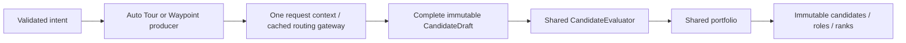

# Planning model

A plan is explicit intent plus a bounded search, followed by immutable publication.
The canonical schema is version 1, with `kind: auto_tour` or `kind: waypoint_route`.
Topology is `loop` or `point_to_point`. Start and an explicit open-route End are hard
constraints. The two modes share public models and publication contracts, not one
algorithm disguised by different controls.

## Automatic route intent

The normal editing strategy is automatic:

```text
Empty map → first empty tap sets Start → Auto Tour
Start + explicit stops or End          → Waypoint Route
Remove the last stop, with no End      → Auto Tour, keeping Start
```

For an open route, the next empty tap fills the missing End before adding interior
stops. In a loop, further taps continuously add stops. Explicit Move Start changes
Start instead of inserting another point. Marker/label selection and Place inspection
do not change intent. Undo restores the most recent placement/removal/edit snapshot;
it is not a route geometry undo or a durable history.

`automatic_intent.js` owns this UI policy. `state.js` owns the drafts and emits
`currentPlanRequest()`. Automatic transitions move active geometry into the appropriate
mode and retain shared distance/name options; mode-specific options are parked. Explicit
legacy mode switching keeps independent drafts. Discovery-specific requested places
cannot be converted losslessly to waypoint constraints, so that intent keeps Auto Tour
explicit. Imported requests retain their explicit kind rather than being inferred away.

Automatic intent never changes the API union or creates a third search algorithm.
Generation availability is derived from the same draft shown by the editor/map.

## Public intent and constraints

| Field / concept | Contract |
| --- | --- |
| Start / End | A loop supplies Start and no End; an open route supplies distinct endpoints. Services do not invent them. |
| Profile | Exactly `hike`, `trail_run`, `city_bike`, `gravel_bike`, `mountain_bike` or `road_bike`, explicitly preserved throughout routing and export. |
| Exact waypoint | Required coordinate with validated snap/arrival; failure cannot trigger an automatic weakened retry. |
| Approach stop | Semantic place plus meaningful route approach; unreachable soft stops are dropped with a reason. |
| Best-effort stop | May be approximated within its explicit bound; preserves semantic and routed coordinates and actual remaining distance. |
| Fixed order | Required-point order is preserved. |
| Optimized order | Endpoints remain fixed; only permitted interior points are reordered by bounded deterministic heuristics, with original identities retained. |
| Distance objective | Target/tolerance first; flexible and balanced tolerance are soft, strict tolerance and explicit maximum are hard. An explicit balanced maximum is hard. |

The reference planner resolves imported places by stable OSM identity, exact normalized
name, then a strict graph target. An approach override is bounded around its semantic
place and must pass normal profile/snap validation. A feature's center alone is never
proof that the routed line reaches the place.

Canonical examples are in `examples/marly/` and `examples/profiles/`. API models reject
unknown fields. `sugarglider-migrate-plan` is an offline legacy conversion tool; HTTP
planning does not accept old schemas.

## Python reference pipeline



`PlanService` dispatches to `WaypointPlanner` or `AutoTourPlanner`. Waypoint search builds
endpoint-fixed controls, order proposals and graph-derived distance detours. Auto Tour
search builds routed controls/skeletons, resolves requested stops and eligible local
POIs, and considers bounded insertions/repairs. Its best no-POI control remains exposed.
Temporary beam/insertion states use structural analysis; expensive Nature/loop geometry
analysis belongs to complete retained routes.

Each request owns one `PlanningSearchContext`. Only its `CachedRoutingGateway` calls
GraphHopper or reserves typed route budget. Cache keys include public/backend profile
identity and route options. Successful and failed calls are cached; repeated failures
cannot consume fresh calls. Pre-backend budget rejection is a separate count.
Diagnostics satisfy lookup = hit + miss, entry = successful + failed, backend call = miss.
Full-route evaluations and alternative-leg calls have separate strict allowances.

`CandidateEvaluator` enriches/validates complete drafts and constructs unranked public
candidates. Shared portfolio construction alone assigns roles/ranks. Optional global
optimization uses the same request gateway, preserves exact/deliberate anchors and
retains original candidates when it fails or cannot qualify an improvement.

## Distance, analysis and recommendation

GraphHopper's total distance is authoritative in the reference path. Geometric edge
lengths are normalized to it before metrics. Routed edge IDs establish repetition;
nearby parallel corridors are not guessed to overlap. Immediate backtracking is
separate from total repetition, and incomplete edge-ID coverage is explicit.

Distance tolerance leads ranking. Route-quality/loop/nature/POI preferences cannot
bypass hard constraints, natural-loop validity or the repetition/backtracking promotion
gate. A refined candidate can be recommended ahead of its standard source only when
repetition falls without increasing immediate backtracking. Nature preferences cannot
outrank those gates. The excursion allowance changes penalty, not raw repetition.

Missing surface/access/network/smoothness/technicality or nature coverage stays unknown.
Loop geometry is explainable analysis, separate from the fixed waypoint score total.
Profiles do not promise safety, legality or current conditions; elevation is not used.

Reversal transforms deliberate intent and reroutes through the same cached/budgeted
boundary, then rebuilds stops/analysis/scores/portfolio. It does not reverse an array in
the browser, and reversing twice need not recover identical geometry.

## Platform capabilities

| Behavior | Python/reference | Android local |
| --- | --- | --- |
| Engine | External GraphHopper | Native Valhalla through a typed WebView bridge |
| Activities | All six public profiles | All six when the selected installed pack supports them |
| Auto Tour | Loop/open; required and soft requested stops; local POI preferences | Loops; regional scenic/water/nature preferences and bounded selected indexed preferences; no required interior hard points or imported requested-stop resolution |
| Waypoint Route | Loop/open; exact/approach/best-effort; distance/quality/refinement preferences | Loop/open, exact waypoints, fixed/optimized order; Shortest with Nature/loop preferences off |
| Quality evidence | Requested GraphHopper path details, including edge-ID coverage | Missing exact edge IDs/path attributes remain unknown; accepted Auto Tour preferences may be reported unmet |
| Search accounting | Typed Python context/cache/budgets | `local_planning_context.js` owns strict cached native call budgets and phase usage |
| Result publication | Shared Python evaluator/portfolio | Worker-based local evaluator/portfolio emits the canonical shape |
| Reverse/refinement | Reference reverse and bounded optional optimizers | No equivalent automatic server fallback; enabled features are determined by local validation/UI |

Read `local_planner.js` and `local_waypoint_route.js` for the exact local validators.
Unsupported preferences, constraint strengths, topology or request bounds leave the
request unchanged and return an explicit error. Local results use native routed
geometry/snaps/distance and do not claim Python detail coverage or feature parity.

## Results, snapshots and GPX

A `PlanCandidate` carries the route, score, stop outcomes, compromises, traversal anchors
and diagnostics. The UI displays reached/approximated/dropped truthfully, and alternative
selection is a projection of returned candidates. It must not rerun generation.

`POST /v2/plans/gpx` accepts the selected returned candidate. Python `gpx/writer.py` and
local `local_gpx_export.js` serialize that snapshot directly: one track, one segment,
no route or analysis/Nature/POI extensions. Selected reached/approximated approaches
are ordered normal GPX waypoints at their validated routed coordinates; dropped stops
are omitted. Imported GPX inspection preserves separate track segments.

Saved routes and outing routes remain exact request/candidate snapshots. Loading them
never generates, reroutes or reranks; only **Use as a new plan** creates independent
editable planner state. See [social service](social-service.md).
